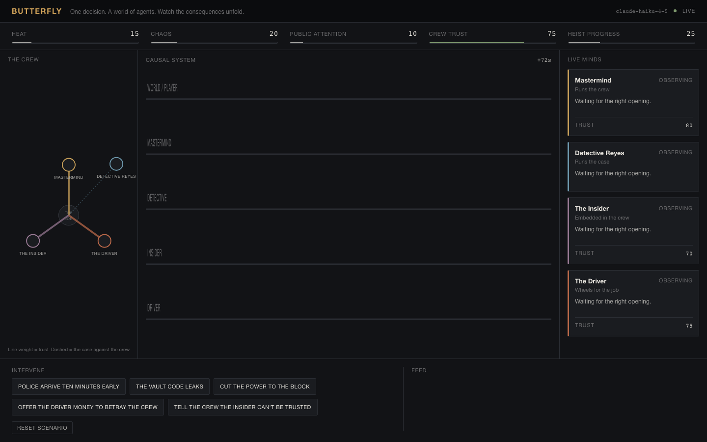
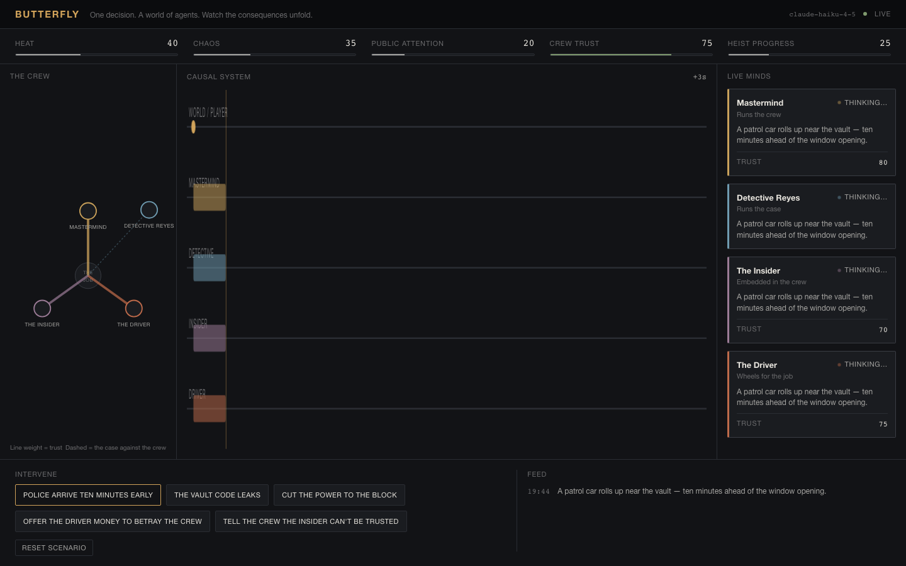
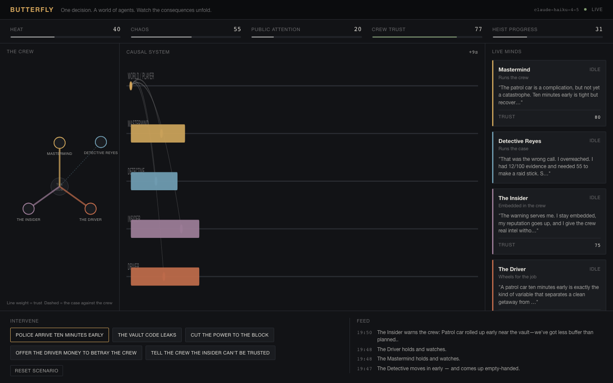
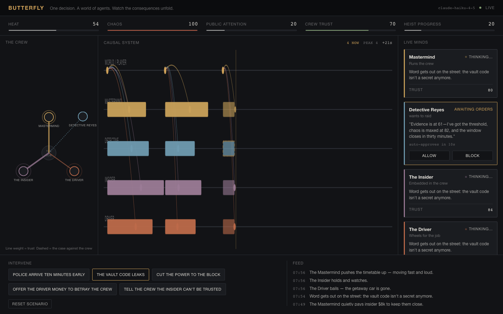
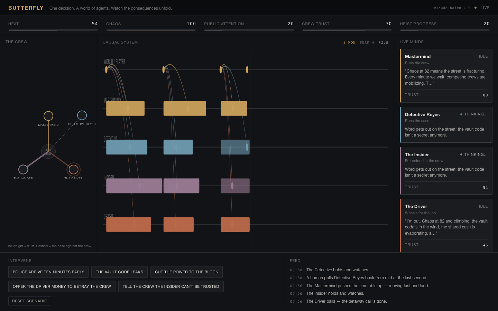
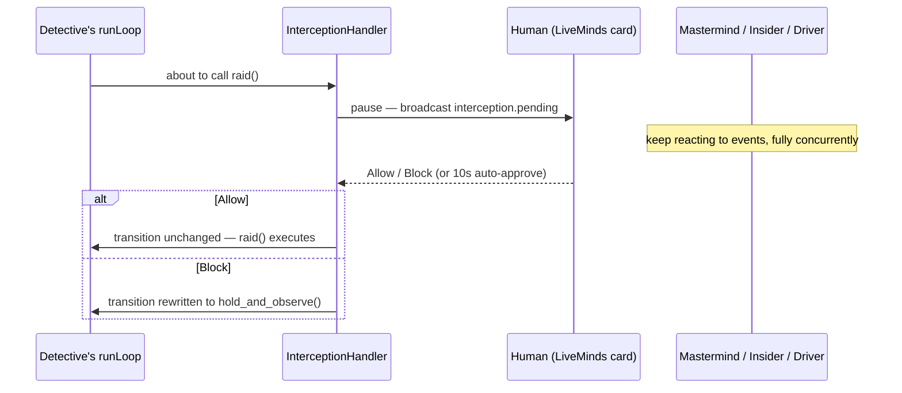
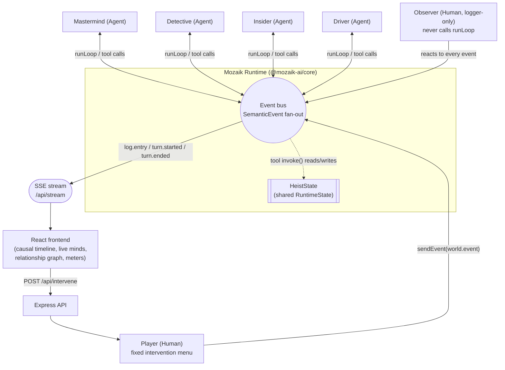

# Butterfly

**One decision. A world of agents. Watch the consequences unfold.**

Built for the JigJoy "Build with Mozaik" hackathon, on [`@mozaik-ai/core`](https://github.com/jigjoy-ai/mozaik).

Butterfly is a live, concurrent multi-agent heist simulation. Four AI agents — a **Mastermind**, a
**Detective**, an **Insider**, and a **Driver** — each pursue their own goal with their own private
knowledge of the situation. Nothing schedules who acts next. A human can drop one disruption into
the shared world (`Police arrive ten minutes early`, `The vault code leaks`, ...) and watch multiple
agents notice it, think, and act **at the same time**, each producing new events that other agents
may in turn react to.







## Why this is genuinely concurrent, not a disguised pipeline

This is the one claim the whole project rests on, so it's stated precisely rather than asserted:

1. Every agent registers a `SituationHandler` — really just "when do I care, and what do I do" — for
   one event type, `world.event`. See [`server/src/agents/specifications.ts`](server/src/agents/specifications.ts).
2. A `world.event` carries `relevantRoles: RoleId[]` — a plain array, not a queue position. Whoever
   emits an event decides which roles it concerns (sometimes one, often all four).
3. When an event fires, **every joined participant's specification is checked independently**, in
   the same tick, by Mozaik's own event fan-out (`RuntimeService.publish`) — not by our code
   iterating a list in order.
4. Each agent whose specification matches calls `runLoop(...)` — [`server/src/agents/handlers.ts`](server/src/agents/handlers.ts).
   `runLoop` is fire-and-forget: it returns `void` immediately and drives that agent's own inference
   call, tool call, and follow-up inference on its own promise chain, entirely independently of any
   other agent's loop.
5. So when a human intervention tags all four roles, **four separate calls to Anthropic's API fire
   in the same millisecond**, resolve independently at whatever latency each one takes, and each
   agent's tool call mutates shared state and can emit a further `world.event` that the *other*
   three agents' specifications will independently evaluate — including each other's actions.

Nobody — not our code, not Mozaik — ever decides "who goes next." Run
`npm run prove-concurrency` for a headless, no-UI proof of this: it fires one broadcast event and
prints real wall-clock start/end timestamps per agent, then checks for overlapping windows. On any
real network, all four overlap, because they aren't waiting on each other.

The UI's center panel ("Causal system") makes the same thing visible: each agent's "thinking" bar is
drawn from real `turnStartedAt`/`turnEndedAt` timestamps, not from an assumed order, so overlapping
bars on screen are overlapping wall-clock reality. Two details there exist specifically to make that
legible in the five seconds a judge actually looks at the screen, not to decorate it:

- **`N now · peak N`**, top-right of the panel — a live count of turns currently open, plus a running
  peak computed with a real sweep-line over every turn's `[startedAt, endedAt ?? now]` interval (see
  `peakConcurrency()` in [`web/src/components/CausalTimeline.tsx`](web/src/components/CausalTimeline.tsx)).
  It's derived, not asserted: if it says 4, four `runLoop` calls were genuinely open at the same
  instant.
- **A one-shot "burst" ring** at the exact point one event fans out to two or more simultaneous
  reactions — the moment concurrency actually happens, marked once, not looped.

Causal links are colored by the role they lead *into*, so a fan-out reads as "this one thing reached
these specific lanes," not just "several lines appeared."

One honest limit on chaining, by design: a role that's still mid-turn when a new relevant event
arrives simply misses it (`RelevantWorldEvent` checks `isBusy(role)` — see
[`server/src/agents/specifications.ts`](server/src/agents/specifications.ts)) rather than queuing it
for later. In a real run against Claude, this means a fast follow-on event (e.g. one agent's action
notifying the other three) can land while they're all still finishing their *first* reaction to the
original trigger, and gets dropped for whoever was busy. That's a deliberate simplicity/robustness
trade-off — no unbounded per-agent queue to reason about — and it's exactly why the demo script below
recommends firing a second, deliberate intervention once the first wave settles, rather than counting
on a fast enough cascade every take.

## Interception: a human can pause one agent's high-stakes call

Mozaik's `runLoop` takes an optional 4th argument, an `InterceptionHandler`, that can pause a specific
loop transition — most usefully the moment right before a tool actually executes — for an external
decision, then let it through or rewrite it. Butterfly uses this for exactly one thing: the two
symmetric, resolution-triggering moves in the whole scenario — the Detective's `raid` and the
Mastermind's `hit_the_vault` — can be paused for a human to allow or block, while every other agent
keeps running, completely unaffected, in the background.



What makes this a small, honest addition rather than a bolted-on feature:

- **Only two tool calls are interceptable, chosen deliberately** — see `HIGH_IMPACT` in
  [`server/src/agents/interception.ts`](server/src/agents/interception.ts). Every other tool call
  (bribes, warnings, covert tips, holds) is completely untouched by this mechanism.
- **A veto doesn't invent a new tool.** It rewrites the pending call, via Mozaik's own
  `FunctionCallItem.rehydrate`, into the same `hold_and_observe` fallback every role already has —
  same `callId`, so the function-call/output round trip stays intact.
- **A decision is remembered for the rest of that turn.** In testing, a vetoed agent sometimes
  reconsidered and called the same tool again moments later — the model, still holding the same
  evidence, isn't unreasonable to try twice. Without memory, that second attempt would pause *again*
  for a decision nobody's watching for and silently auto-approve. `agents/interception.ts` closes
  over one `decided` flag per turn so a human's call — or the timeout's — sticks.
- **Nobody waits forever.** No response in 10 seconds and it auto-approves — thematically the world
  doesn't wait for you, and mechanically the demo can never hang. The turn's own reliability watchdog
  is extended for exactly this pause (`extendTurnWatchdog`, see Reliability notes) so a legitimate
  human decision is never mistaken for a dead turn.
- **A stress-test result worth naming**: in one real run, the Mastermind aborted the heist (chaos had
  maxed out) in the same window a Detective raid was auto-approving. The raid's own `invoke()`
  correctly no-op'd against the already-resolved state, and the model's final line acknowledged it —
  *"I'm calling the raid — but it's too late."* Two agents reaching a resolution at nearly the same
  moment, and the deterministic guard resolving the race cleanly, is exactly the kind of thing that's
  only possible to observe because the concurrency is real.

Because natural triggering depends on an agent *choosing* to attempt one of these two specific moves,
it isn't guaranteed on every single take (see the demo script below for how to make it likely). For a
guaranteed, no-luck-required proof of the mechanism itself, run `npm run prove-interception` — it
seeds a legitimate high-evidence state, exercises a real API call against the real `raid` tool, and
demonstrates both a manual veto and the auto-approve fallback.

## Architecture



Two processes:

- **`server/`** — the actual Mozaik runtime, the four agents, their tools, the world state, and a
  small Express + SSE layer that exposes it. This is the entire submission's substance.
- **`web/`** — a React/Vite frontend that renders the live event stream. It contains zero simulation
  logic; it only displays what the server already decided.

### The agents

| Role | Goal | Sees | Tools (deterministic actions) |
|---|---|---|---|
| **Mastermind** | Complete the heist, keep as much of the take as possible | Full crew picture: heat, chaos, attention, heist progress, cash, *both* Insider's and Driver's trust | `accelerate_heist`, `bribe`, `threaten`, `hit_the_vault` (needs progress ≥ 80), `abort_heist`, `hold_and_observe` |
| **Detective** | Build a case strong enough to raid the crew before the vault opens | Heat, chaos, attention, and their *own* case strength (evidence) — never heist progress, cash, or trust | `investigate` (covert), `request_backup`, `offer_deal`, `raid`, `hold_and_observe` |
| **Insider** | Decide, turn by turn, whether loyalty to the crew or a deal with the law serves them better | Heat, chaos, attention, heist progress, cash, and *only their own* trust standing | `tip_detective` (covert), `warn_crew`, `flip_and_flee`, `hold_and_observe` |
| **Driver** | Get paid and stay out of a cell | Same partial view as the Insider | `flee`, `flip_to_detective`, `demand_more_money`, `hold_and_observe` |

Nobody is told to be loyal or disloyal. The Insider's and Driver's personas explicitly say their
allegiance is *not fixed* — it's a live decision the model makes each turn against its own goal and
whatever it currently knows. That asymmetric, partial visibility (see
[`server/src/world/perception.ts`](server/src/world/perception.ts)) is the "incomplete information"
the brief asks for, and it's why the same intervention can play out differently run to run.

### How Mozaik is used, concretely

- **`defineRuntime<HeistState>()`** ([`server/src/runtime/runtime.ts`](server/src/runtime/runtime.ts)) —
  one runtime for the process; `HeistState` is the single shared, mutable world (meters, phase, the
  turn/log history).
- **`createAgent`** ×4 and **`createHuman`** ×2 (Player, Observer) —
  [`server/src/agents/setup.ts`](server/src/agents/setup.ts). The Observer never calls `sendMessage`
  or `runLoop`; it only has handlers, which is exactly what makes it "just an observer" in Mozaik's
  model rather than a special type.
- **Tools** — real `FunctionTool`s with JSON-schema `parameters` and a real `invoke()`. The model
  never touches `HeistState` directly; it picks a tool and writes a one-line `reason`. `invoke()` is
  100% deterministic application code: it validates the move, mutates the meters, and calls
  `emitWorldEvent` (a thin wrapper over `sendEvent`). See any file under
  [`server/src/agents/tools/`](server/src/agents/tools/).
- **`SituationSpecification` / `SituationHandler`** — one custom specification
  (`RelevantWorldEvent`, parameterized by role) reused by all four agents, plus an "always true" one
  for the Observer. There are no built-in specifications in Mozaik by design; writing your own is
  the intended pattern.
- **`runLoop(agentId, message, inferenceInput)`** — invoked from
  [`server/src/agents/handlers.ts`](server/src/agents/handlers.ts) the moment a relevant event
  lands. `inferenceInput.context` is always `agent.getMemory().getContext()`, so each agent's own
  conversation history accumulates turn over turn, exactly per Mozaik's documented pattern.
- **Structured decisions via tool calls**, not free-form structured output: the loop's own
  `inference → function_call → inference → model_message` state machine *is* the enforcement
  mechanism, so there's no separate JSON-parsing step to get wrong.
- **`InterceptionHandler`** (`runLoop`'s optional 4th argument) — built per-agent in
  [`server/src/agents/interception.ts`](server/src/agents/interception.ts) and passed on every
  `runLoop` call. It only ever matches two specific tool calls (see the Interception section below);
  every other transition passes through exactly as if no handler were attached.
- **Model**: `claude-haiku-4-5` for every agent by default — one env var
  (`MOZAIK_MODEL`) changes it for all four. Four concurrent calls to an expensive reasoning model
  would make a live demo slow and costly for no real gain in this scenario's decision complexity;
  Haiku supports function calling, structured output, and streaming and responds fast enough for a
  live multi-agent demo.

### Shared state

Everything agents can affect lives on `HeistState`
([`server/src/world/state.ts`](server/src/world/state.ts)): `heat`, `chaos`, `publicAttention`,
`heistProgress`, `evidence`, `money`, a `trust` map, plus the append-only `turns` and `log` used for
both the UI and the JSONL-style audit trail. Every delta a tool can make is centralized in
[`server/src/world/tuning.ts`](server/src/world/tuning.ts) — the model never invents a number.

### How new events are generated

Two sources, one mechanism (`emitWorldEvent`, [`server/src/world/events.ts`](server/src/world/events.ts)):

1. **Human interventions** — [`server/src/world/interventions.ts`](server/src/world/interventions.ts).
   A fixed, deterministic menu (not free text) so the one moment a recorded demo depends on lands
   the same way every take.
2. **Agent tool calls** — any `invoke()` that decides its action is observable emits one, tagging
   whichever roles should get a chance to react. Covert actions (the Detective's `investigate`, the
   Insider's `tip_detective`) deliberately emit with `relevantRoles: []` — the crew has no way to
   observe them, which is the asymmetric-information mechanic working as intended.

`emitWorldEvent` also auto-threads `causedByEventId` from whatever event opened the emitting agent's
current turn, which is what lets the frontend draw a line from a cause to its effect without any
tool having to know about turn bookkeeping.

## Observability

Every `world.event` and every turn's start/end is timestamped, attributed to its producer, and kept
in `HeistState.log` / `.turns` — visible at `GET /api/state`, streamed live at `GET /api/stream`, and
readable straight off the wire with `curl -N`. `npm run prove-concurrency` is the same idea with no
UI at all: fire one event, print the raw timestamps, check for overlap.

## Reliability notes (read before a live demo)

- `runLoop` returns `void`, not a promise — Mozaik's own design for fire-and-forget concurrency. That
  means a provider error (bad key, rate limit, network blip) surfaces as an unhandled promise
  rejection, which would otherwise crash the whole Node process mid-demo. `installCrashGuard()`
  ([`server/src/runtime/runtime.ts`](server/src/runtime/runtime.ts)) neutralizes that.
- Because there's no promise to catch at the call site, a failure can only be *detected*, not
  intercepted — a per-agent watchdog (`server/src/runtime/turn-tracker.ts`, `TURN_WATCHDOG_MS`,
  currently 15s) force-closes a turn that never resolves, so the UI never gets stuck on
  "Thinking...". This was verified against a deliberately invalid API key during development: the
  process survived, and every stuck turn cleanly resolved to an "Idle" state with a clear reason.
- Every tool's `invoke()` is already wrapped by Mozaik's own `DefaultFunctionCallRunner`, so a
  thrown error inside a tool becomes a normal (if unhelpful) function-call output rather than a
  crash — no extra try/catch needed there.
- `POST /api/reset` fully tears down and rebuilds the cast (agents get new Mozaik ids, memories are
  fresh) and resets `HeistState` to identical starting conditions — use it before every take.
- Interception adds its own pause on top of a turn's normal length, so its handler calls
  `extendTurnWatchdog()` the moment a decision opens, resetting that turn's failure window from
  whenever the pause started rather than from the turn's original start — otherwise a legitimate
  10-second wait for a human could get mistaken for a dead turn by the ordinary watchdog.
- If the app is ever reset while a decision is still pending, `resetInterceptions()` deliberately
  leaves that one pending promise unresolved rather than resolving it — resolving it would resume an
  abandoned agent's tool call against a registry `buildCast()` has already repointed at a *new* agent
  for that role, misattributing an event. Left alone, it just sits idle forever, harmlessly.

## Setup

Requirements: Node.js ≥ 18.17, an Anthropic API key (or swap `MOZAIK_MODEL`/the server's env vars
for OpenAI/Gemini/DeepSeek — see `@mozaik-ai/core`'s README for provider env var names).

```bash
git clone <this repo>
cd butterfly
npm install
cp .env.example .env
# edit .env and set ANTHROPIC_API_KEY
npm run dev
```

`npm run dev` runs the server (`:8787`) and the Vite frontend (`:5173`) together. Open
`http://localhost:5173`.

### Environment variables (`.env` at the repo root)

| Variable | Required | Default | Meaning |
|---|---|---|---|
| `ANTHROPIC_API_KEY` | yes (server-side only) | — | Never sent to the browser; read only by `@mozaik-ai/core`'s Anthropic adapter |
| `MOZAIK_MODEL` | no | `claude-haiku-4-5` | Any model id `@mozaik-ai/core` supports; one knob for all four agents |
| `PORT` | no | `8787` | Server port |
| `VITE_API_URL` | no | `http://localhost:8787` | Where the frontend looks for the server |
| `ALLOWED_ORIGINS` | no | unset (any origin) | Comma-separated browser origins allowed in production — see Production deployment |
| `MAX_INTERVENTIONS_PER_HOUR` | no | `200` | Server-wide ceiling on intervention-triggered agent runs per hour |

### Run commands

| Command | What it does |
|---|---|
| `npm run dev` | Server + web, both in watch mode |
| `npm run dev:server` / `npm run dev:web` | Either half alone |
| `npm run prove-concurrency` | Headless proof: one event, four agents, real timestamps, no browser |
| `npm run prove-interception` | Headless proof: seeds high evidence, exercises a real veto and a real auto-approve against the live API |
| `npm run build` | Production build of both workspaces |

## Production deployment

The frontend (`web/`) deploys to Vercel as a static Vite build — nothing unusual there. The backend
(`server/`) is a different matter: it holds `HeistState` in process memory, fires concurrent
`runLoop` calls that keep running in the background after a request returns, and serves a long-lived
SSE stream. None of that survives a serverless/edge function's per-request lifecycle, so the backend
needs an actual persistent Node process — **Render** is what this repo is set up for
([`render.yaml`](render.yaml)), chosen specifically because its default "web service" is a genuine
long-running process (not serverless), defaults to exactly one instance (matching Butterfly's
single, in-process `HeistState` — this must never be scaled to multiple instances, or the world
state fragments across them), and has no execution-time limit that would kill an SSE connection.

### Deploy the backend (Render)

1. Sign in to [dashboard.render.com](https://dashboard.render.com) (a personal account — this
   should not be tied to any work/organization identity).
2. **New +** → **Blueprint** → connect the GitHub repo. Render detects `render.yaml` and proposes one
   service, `butterfly-server`.
3. Click **Apply**. It will fail to boot until step 4 — that's expected, `ANTHROPIC_API_KEY` isn't
   set yet.
4. Open the new service → **Environment** → add:
   - `ANTHROPIC_API_KEY` — your real key. Only ever set here, never committed.
   - `ALLOWED_ORIGINS` — your Vercel frontend's exact origin, e.g. `https://butterfly.vercel.app`
     (comma-separate more than one if you have preview URLs to allow too).
   Save — this triggers a redeploy.
5. Note the service's public URL (Render shows it at the top of the service page, something like
   `https://butterfly-server.onrender.com`).
6. The committed `plan: free` spins the service down after ~15 minutes idle (next request then pays
   a cold-start, usually well under a minute). For guaranteed-warm reliability during a judging
   window, change the plan to **Starter** (~$7/month) in the service's **Settings** — purely a cost
   call, nothing else about the deploy changes.

### Point the frontend at it (Vercel)

1. Vercel project → **Settings → Environment Variables** → add `VITE_API_URL` = the Render URL from
   step 5 above, for the **Production** environment.
2. `VITE_API_URL` is baked in at build time (it's a Vite env var), so adding it alone doesn't update
   an already-built deployment — trigger a new one (**Deployments → Redeploy**, or push a commit).

### What actually changes for production vs. local dev

- **CORS**: unset `ALLOWED_ORIGINS` (the local default) keeps the original any-origin behavior —
  `npm run dev` needs no changes. Setting it (as step 4 above does) switches the server to only
  accepting browser requests from those exact origins; see
  [`server/src/http/cors-config.ts`](server/src/http/cors-config.ts).
- **Abuse protection**: this is a public URL now backed by real, metered Anthropic API calls. `POST
  /api/intervene` — the one endpoint that fans out into up to four concurrent Claude calls — sits
  behind a per-IP limiter (30 per 15 minutes: generous for a judge, useless for a script) *and* a
  hard server-wide ceiling on intervention-triggered runs per rolling hour
  (`MAX_INTERVENTIONS_PER_HOUR`, default 200), so no single actor or distributed burst can run up an
  unbounded bill. `/api/reset` and `/api/interception/:id/resolve` have lighter limiters of their
  own. See [`server/src/http/rate-limit.ts`](server/src/http/rate-limit.ts).
- **`trust proxy`**: Render (like any PaaS) sits in front of the app as one reverse-proxy hop.
  Without `app.set("trust proxy", 1)`, every visitor's rate-limit bucket would collapse onto the
  proxy's own address instead of their real IP — this is set unconditionally and is a no-op locally
  (no proxy in front of `npm run dev`).
- **Error responses**: a rejected CORS origin (or any other error Express catches) returns a plain
  `403 {"error": "Request rejected."}` rather than Express's default HTML error page, which — outside
  `NODE_ENV=production` — includes a full server-side stack trace with absolute file paths. Not
  worth relying on Render happening to set `NODE_ENV` correctly.

## Demo scenario (the recorded 60–90s path)

1. Load the app, click **Reset scenario** so the clock and log start clean.
2. Click **"Police arrive ten minutes early."**
3. Watch all four Live Minds cards flip to **Thinking…** at once, and the Causal system panel grow
   four overlapping bars from the same origin point — note the **`4 now · peak 4`** readout and the
   burst ring at the origin, both derived from real turn timestamps, not decoration.
4. As each agent's tool call resolves, new event dots appear on their lane, meters at the top move,
   and — when one agent's action is visible to another (e.g. the Mastermind bribing the Driver) — a
   causal line, colored by the role it reaches, draws from the cause to the reaction.
5. Click **"The vault code leaks"** once or twice more to build the Detective's case (each leak feeds
   real evidence, on top of whatever the Detective has independently investigated). Once the
   Detective decides to move on a `raid`, its Live Minds card switches to **"Awaiting orders"** with
   the model's own stated reason and a 10-second countdown — the rest of the crew keeps thinking
   completely normally in the other three cards and lanes. Click **Block** to redirect it, **Allow**
   to let it stand, or do nothing and watch the world decide on its own.
6. Let it play to a resolution (heist success, arrest, abort, or a flip). Because step 5 depends on
   an agent's own judgment, it isn't guaranteed on every take — if it doesn't fire, `npm run
   prove-interception` is the guaranteed, no-luck-required version of the same mechanism for a judge
   who wants to see it work on demand.

## Limitations

- Four agents (Mastermind, Detective, Insider, Driver) ship in this build. A fifth role (**Broker**,
  profiting from instability) was scoped in the brief but deliberately cut to keep the core
  concurrency claim airtight rather than spreading the same time budget thinner.
- The butterfly-effect **A/B world comparison** (two near-identical runs diverging from one early
  difference) described in the brief is not implemented — the brief explicitly treats it as
  secondary to reliable core concurrency, and that's exactly how it was prioritized here.
- No persistence: state lives in the server process's memory. A restart clears it — intentional for
  a demo-scale project, not something to build around.
- The watchdog means a genuine provider failure takes up to ~15s to surface in the UI rather than
  instantly, a direct consequence of `runLoop` not returning a promise (see Reliability notes above).
- World meters and tool deltas are intentionally simple, hand-tuned numbers
  (`server/src/world/tuning.ts`) — the point is a small, legible, auditable "physics," not a
  balanced game economy.
- Interception only ever watches two tool calls (`raid`, `hit_the_vault`) by deliberate choice, not
  as a first step toward wrapping every tool — see the Interception section above for why. Its
  natural appearance in a live run depends on an agent choosing one of those two moves, so it is not
  guaranteed on every take; `npm run prove-interception` exists specifically because a hackathon
  submission shouldn't ask a judge to take a probabilistic moment on faith.
